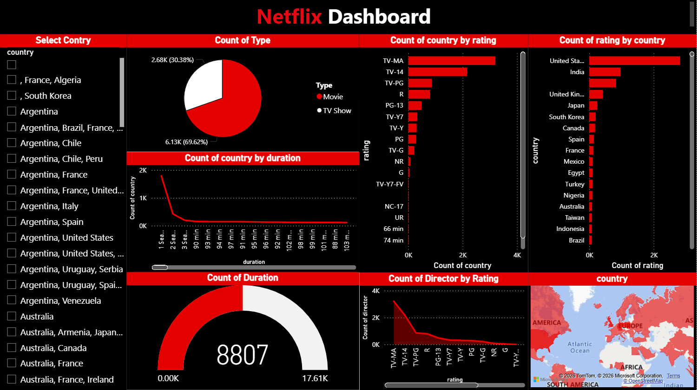

# 📊 Netflix Data Insights: An Interactive Power BI Dashboard


---

## 🎯 Project Overview

This project presents an **interactive data analytics dashboard** built using **Power BI Desktop** and **Microsoft Excel** to explore and visualize the Netflix Movies and TV Shows dataset. The dashboard provides meaningful insights into content distribution, ratings, country-wise production trends, and duration patterns across 8,800+ titles.

---

## 📸 Dashboard Preview



> *Netflix-themed interactive dashboard with black & red UI*

---

## 📁 Repository Structure

```
netflix-powerbi-dashboard/
│
├── netflix_dashboard.pbix       # Power BI Desktop file (main project)
├── netflix_titles.csv           # Dataset (source: Kaggle)
├── screenshot.png               # Dashboard screenshot
└── README.md                    # Project documentation
```

---

## 📦 Dataset

| Property | Details |
|---|---|
| **Source** | [Kaggle - Netflix Movies and TV Shows](https://www.kaggle.com/datasets/shivamb/netflix-shows) |
| **File** | `netflix_titles.csv` |
| **Rows** | 8,807 titles |
| **Columns** | 12 (show_id, type, title, director, cast, country, date_added, release_year, rating, duration, listed_in, description) |

---

## 📊 Dashboard Visuals

| Visual | Description |
|---|---|
| 🥧 **Pie Chart** | Movies vs TV Shows distribution (69.62% vs 30.38%) |
| 📊 **Bar Chart** | Count of country by rating |
| 📊 **Bar Chart** | Count of rating by country |
| 📈 **Line Chart** | Count of country by duration |
| 🎯 **Gauge Chart** | Total content count (8,807 out of 17.61K) |
| 📉 **Line Chart** | Count of director by rating |
| 🗺️ **Map Visual** | Global content distribution by country |
| 🔘 **Slicer** | Country-based dynamic filtering |

---

## 🔍 Key Insights

- 🎬 **Movies dominate** Netflix at **69.62%** (6,131 titles) vs TV Shows at **30.38%** (2,676 titles)
- 🌍 **United States** is the largest content producer with 4,000+ titles, followed by **India** and **United Kingdom**
- 🔞 **TV-MA** is the most common rating with 3,207 titles — Netflix heavily targets mature audiences
- ⏱️ Most movies fall in the **90–100 minute** range; most TV shows have **1–2 seasons**
- 🎥 **TV-MA rated content** has the highest director count (3,800+)
- 📅 Content production **peaked around 2018–2020**, reflecting rapid platform growth

---

## 🛠️ Tools & Technologies

- **Power BI Desktop** — Dashboard creation, DAX measures, cross-filtering
- **Power Query Editor** — Data cleaning, null handling, date formatting
- **DAX (Data Analysis Expressions)** — Calculated columns and measures
- **Microsoft Excel** — Initial data review and preprocessing
- **Kaggle** — Dataset source

---

## 🚀 How to Run

1. **Clone this repository**
   ```bash
   git clone https://github.com/hetpatel1812/netflix-powerbi-dashboard.git
   ```

2. **Install Power BI Desktop** (free)
   - Download from [powerbi.microsoft.com/desktop](https://powerbi.microsoft.com/desktop/)

3. **Open the Dashboard**
   - Open `netflix_dashboard.pbix` in Power BI Desktop

4. **Refresh Data (if needed)**
   - Go to `Home → Refresh` to reload from the CSV
   - Make sure `netflix_titles.csv` is in the same folder

5. **Explore the Dashboard**
   - Use the **country slicer** on the left to filter all visuals
   - Click on any visual to apply cross-filtering across the dashboard

---

## 📚 References

1. [Netflix Movies and TV Shows Dataset — Kaggle](https://www.kaggle.com/datasets/shivamb/netflix-shows)
2. [Microsoft Power BI Documentation](https://docs.microsoft.com/en-us/power-bi/)
3. [Power Query Editor Guide — Microsoft Learn](https://learn.microsoft.com/en-us/power-query/)
4. [DAX Reference — dax.guide](https://dax.guide/)
5. AICTE Microsoft Elevate Internship Program — Course Material (Feb 2026)

---
---

*Made with ❤️ using Power BI*
